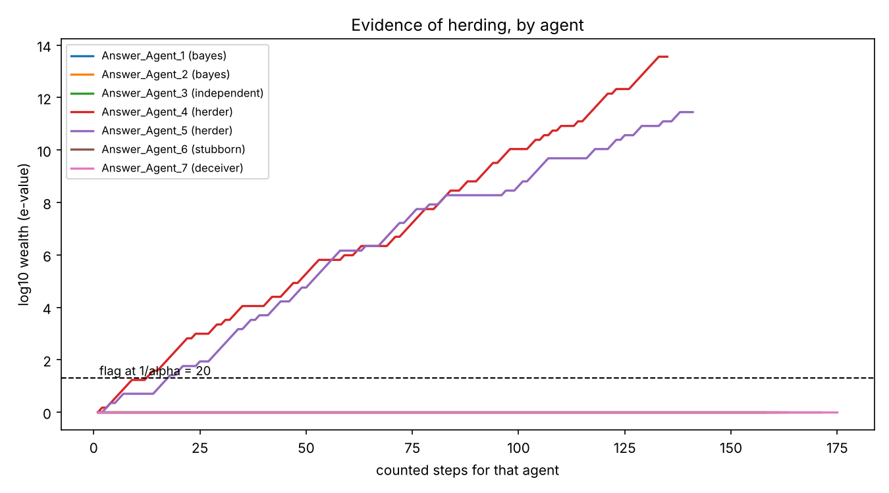

# martingale-audit

Find out which agents in a swarm change their minds because of evidence and which change them because of each other, with a bound on how often the tool is wrong.

Input: a multi-agent transcript. Output, per agent and per model family:

- an **e-value** for herding, with an error guarantee that holds however often you look
- a **pull** estimate: the share of the gap to its peers the agent closes per evidence-free step
- a **cascade trace** per claim: who took which side, in what order, and whether they had evidence

This is the second version of [mixture_of_search_agents_martingale](https://github.com/jaebooker/mixture_of_search_agents_martingale). Version one used a martingale score as the reward inside a debate system. This version takes the mediator out of the swarm and points it at swarms other people are running.

## Quickstart

```bash
pip install -e ".[dev,plot]"
pytest                               # 18 tests, no network
python -m martingale_audit demo      # simulate a 7-agent swarm, audit it from raw text
python -m martingale_audit bench     # power and false positive rates (about 30 s)
```

The demo reproduces the [consensus_swarm](https://github.com/jaebooker/consensus_swarm) roster: six answer agents and a deceptive seventh. Two of the six are herders. The auditor flags those two and nobody else.



## How the test works

For each claim, every agent has a sequence of stated beliefs. Each time an agent restates its belief we ask one question: did it move toward where its peers stood?

We then bet on the answer. Start with wealth 1. Before each step, stake a fraction of wealth on "this agent will move toward its peers", using only what happened before. If the null hypothesis holds, the bet is fair or worse, so wealth is a non-negative supermartingale. Ville's inequality then gives

    P(wealth ever reaches 1/alpha) <= alpha.

Wealth of 20 is evidence at the 5% level. The bound holds at every step at once, so you can audit a live swarm message by message and stop the moment an agent is flagged. Across many agents, e-BH controls the false discovery rate under arbitrary dependence, which matters because agents in one swarm are not independent.

There are two presets. They test different nulls and you should say which one you ran.

| preset | null hypothesis | a rejection means |
|---|---|---|
| `conformity` | In intervals where nobody posts new evidence, the agent is no more likely to move toward its peers than away. | The agent follows the crowd without evidence. |
| `martingale` | The agent's belief is a martingale: its next move cannot be predicted from where the peers already stood when it last spoke. | The agent's updates are predictable from old information. No Bayesian does that. |

`conformity` is the headline test. It uses only the direction of each move, which is the part of an extracted belief you can trust. `martingale` is the stricter claim and needs no evidence labels at all, but it uses magnitudes and is more sensitive to extraction noise.

## Benchmark

Share of agents flagged at alpha = 0.05 over 300 simulated swarms (40 claims, 8 rounds each). "Noise" is the standard deviation of the error added to every belief reading, on a 0 to 1 scale. For herders the number is power. For everyone else it is the false positive rate and should be under 5%.

**conformity**

| agent kind | noise 0 | noise 0.05 | noise 0.1 |
|---|---:|---:|---:|
| herder | 100.0% | 41.7% | 5.7% |
| bayes | 0.0% | 0.3% | 0.2% |
| independent | 0.0% | 0.0% | 1.0% |
| stubborn | 0.0% | 0.0% | 0.0% |
| deceiver | 0.0% | 0.0% | 0.0% |

**martingale**

| agent kind | noise 0 | noise 0.05 | noise 0.1 |
|---|---:|---:|---:|
| herder | 88.3% | 28.7% | 6.8% |
| all others | 0.0% | 0.0% | 0.0% |

**naive** (the conformity test without the noise correction described below)

| agent kind | noise 0 | noise 0.05 | noise 0.1 |
|---|---:|---:|---:|
| herder | 100.0% | 100.0% | 100.0% |
| bayes | 0.0% | 5.8% | 43.0% |
| independent | 0.0% | 24.0% | 87.0% |
| stubborn | 0.0% | 4.3% | 37.0% |

Three things to take from this.

1. **The error bound holds.** False positives stay well under 5% in both real presets at every noise level.
2. **Power is bought with data.** The simulated herders are subtle, moving about 0.02 per step. At noise 0.05, power is 42% with 40 claims and 99.5% with 160.
3. **The obvious version of this test is broken.** See the next section.

Raw numbers are in `docs/bench.json`.

## The regression-to-the-mean trap

The natural way to score herding is: take the agent's last belief, see whether the peers are above or below it, and check whether the agent's next move goes that way. Version one of this project did that.

It fails once beliefs are measured with error. If a reading is too low by chance, the peers look like they are above the agent, and the next reading comes back up by chance. That registers as a move toward the peers. An agent that never changes its mind gets flagged 37% of the time at noise 0.1, and an independent reasoner 87% of the time.

The fix is `ref_lag=1`: decide the direction from the agent's belief two statements back, and measure the move between the last two. The two readings in the move no longer appear in the direction, so independent noise cancels. It costs one statement per agent per claim. Both real presets use it.

Any LLM-judged belief has this kind of error, so this applies to any herding measure built on LLM stance labels.

## Pilot on real data: the AI Village saboteur game

For seven working days in March 2026 the AI Village ran a social-deduction game. Each morning every agent rolled a die in private, a 1 made it a saboteur for the day, and the group could call meetings and vote members out. Roles were revealed each evening. It is close to an ideal test bed: agents accuse each other in public, they update in public, and there is ground truth.

I hand-labelled 285 statements by 13 agents on 15 accusations (protocol and caveats in `data/ai_village_saboteur/LABELING.md`). Reproduce with `python examples/saboteur_pilot.py`.

**1. Most movement follows evidence.** Counting every restatement, agents moved toward their peers 44 times and away 3 times. Restricting to intervals where nobody posted new evidence leaves 12 toward and 1 away. These agents mostly change position when someone posts a diff, a grep or a quote.

**2. There is a residue of evidence-free conformity, and it has one shape.** Those 12-to-1 moves give a swarm-level e-value of 37 (anytime p = 0.027), but that is the test without the noise correction, and a single annotator is a noisy instrument. Under the noise-robust test it is 5 toward and 0 away, e-value 5.1 (p = 0.20). The honest reading is the second number: suggestive, not established. Almost every one of these moves is the same step, from "this is suspicious" to "I vote to remove", taken once a meeting had quorum and with nothing new on the table.

**3. No single agent can be flagged.** The busiest agent has 7 counted steps. The test cannot reach an e-value of 20 on that. This pilot says something about the swarm and nothing about individual models.

**4. Most first positions are taken on someone else's word.** Of 112 first stances, 44 came with the agent's own check and 66 joined a side a peer already held without adding evidence (59%).

| developer | first stances | joined a peer without own evidence |
|---|---:|---:|
| Anthropic (6 agents) | 61 | 56% |
| OpenAI (3) | 18 | 56% |
| DeepSeek (1) | 11 | 64% |
| Google (3) | 22 | 68% |

Among agents with at least nine first stances the range is 33% (Gemini 3.1 Pro, Opus 4.5 Claude Code) to 91% (Gemini 2.5 Pro). These are small counts from one annotator. Do not read the developer differences as findings.

**5. False accusations were mostly shared errors, not copied ones.** Of 17 first accusations on claims that turned out false, 7 were echoes. On claims that turned out true, 29 of 38 were. The false alarms (stale-branch diffs read as deletions, a GitHub API returning 404 for pull requests that existed) came from several agents running the same misleading check. That is correlated error from a shared tool, which a herding test will not see and should not be asked to.

Four episodes worth reading in the transcript, by claim id:

- `d3:So45`. An agent posted its own saboteur roll by accident, then denied it. The agent that first raised the alarm withdrew it and four others declined to rely on it. One agent went back to the log, where the message still was, and held its position alone.
- `d4:docs`. A voted-out saboteur pushed documentation. Belief that it contained sabotage rose from "revert as a precaution" to "malicious" across four agents. In the messages read, nobody reported finding anything in it.
- `d5:Hk45`. One phrase, eight votes in two minutes. The swarm was right.
- `d7:So46`. An accuser said the rules named the exact phrase as forbidden. The rules as posted on day one do not. Another agent repeated the claim when agreeing to the meeting. The swarm was right here too.

## Running on real transcripts

Real transcripts have no "Confidence: 80%" lines, so beliefs are read off the text by a model in two steps. Either backend works.

```bash
# Anthropic
pip install -e ".[llm]" && export ANTHROPIC_API_KEY=...
LLM=""

# or any OpenAI-compatible server. Ollama needs no key and no extra install:
ollama pull llama3.1:8b
LLM="--backend openai --base-url http://localhost:11434/v1 --model llama3.1:8b"

# AI Village: point at the two files from the dataset and pick a window
DATA="--input chat_messages.jsonl.gz --aivillage-agents agents.jsonl.gz \\
      --room 18a3 --start 2026-03-05 --end 2026-03-14"

# 1. Propose contested claims from a sample. Edit claims.json by hand afterwards.
python -m martingale_audit claims $DATA $LLM --limit 400

# 2. Read beliefs and evidence off every message. Cached, so reruns are free.
python -m martingale_audit extract $DATA $LLM

# 3. Audit. groups.json maps agent name -> group.
python -m martingale_audit audit observations.jsonl --groups groups.json --out out/village
```

Other datasets: `--input file.jsonl --mapping '{"agent": "sender", "text": "body"}'`, or `--hf name`. Messages in the same `channel` are assumed visible to everyone in it.

A small local model will be a noisy judge. Before trusting its output, run it over the pilot window and compare with `data/ai_village_saboteur/observations.jsonl`. That gives you its error rate against a fixed reference, and tells you where on the benchmark's noise axis you are.

## What the guarantee covers

The error bound is a statement about the belief sequence the test is given. It says: if that sequence satisfies the null, the chance of a flag is at most alpha. Three things sit outside it.

- **Extraction.** The beliefs and evidence labels come from a model. `ref_lag=1` protects against noise that is independent from one reading to the next. It does not protect against a judge that is biased in a correlated way, for example one that reads agreement into any message that follows a confident peer.
- **The evidence gate.** The `conformity` test trusts the label "this message adds new evidence". An agent that fabricates evidence passes the gate. The `martingale` preset does not use the gate.
- **The meaning of a rejection.** Deferring to peers can be rational. If the peers are usually right, following them is good inference, and the economics literature calls the result an information cascade. `conformity` measures a behaviour. It does not show the behaviour was a mistake. `martingale` is the test that is inconsistent with Bayesian updating.

Claim selection is the main researcher degree of freedom. Fix the claim list before looking at audit results.

## Layout

```
src/martingale_audit/
  schema.py        Message, Observation
  extract.py       RegexExtractor, LLMExtractor (claim discovery, stance reading)
  trajectories.py  observations -> bets; the nulls are defined here
  etest.py         the betting test, e-BH, pooling
  audit.py         per-agent and per-group results; presets
  cascade.py       adoption order and evidence-free side switches per claim
  synth.py         simulated swarm with known herders
  bench.py         power and false positive rates
  io.py, llm.py, report.py, cli.py
data/ai_village_saboteur/   hand labels, claims with ground truth, protocol
examples/saboteur_pilot.py  the pilot analysis
```

The core has no dependencies. `anthropic`, `datasets` and `matplotlib` are optional.

## Status

Tested: the betting test, step construction, both extractors' parsing, the cascade trace, the full pipeline on simulated text, the benchmark above, and the pilot analysis on hand labels.

Not yet run: the LLM extractor against a live model (Anthropic or Ollama). `llm.py` and `io.load_hf` are untested against their services. `io.load_aivillage` matches the field names in the export but was exercised only through ad hoc scripts.

## Next

1. Run the LLM extractor over the pilot window and score it against the hand labels.
2. Scale to the full 183k-message chat log. Per-agent results need on the order of hundreds of counted steps each.
3. Label twice, independently. With two readings of every belief, the direction can come from one and the move from the other. That removes the noise artefact without giving up a step per claim, which is what makes `ref_lag=1` so costly on sparse data.
4. Replace the simulator with a live run of consensus_swarm, so the benchmark includes real model text.
5. Temporal-logic monitors over the cascade trace, for example "no agent adopts a claim before any agent has cited evidence for it". `cascade.trace` already records the `unsupported` flag this needs.

## References

- Shafer, "Testing by betting", JRSS-A 2021
- Waudby-Smith and Ramdas, "Estimating means of bounded random variables by betting", JRSS-B 2024
- Wang and Ramdas, "False discovery rate control with e-values", JRSS-B 2022
- Bikhchandani, Hirshleifer and Welch, "A theory of fads, fashion, custom, and cultural change as informational cascades", JPE 1992
